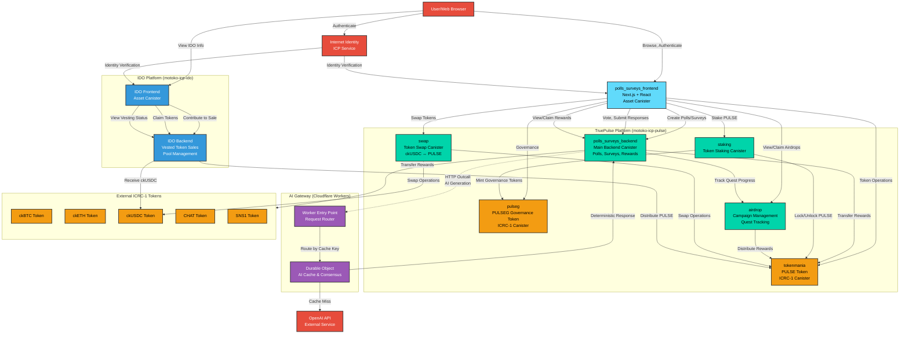

# TruePulse System Architecture

## System Overview

TruePulse is a decentralized polls and surveys platform built on the Internet Computer Protocol (ICP), consisting of multiple interconnected systems:

1. **TruePulse Main Platform** (motoko-icp-pulse)
2. **IDO Platform** (motoko-icp-ido)
3. **AI Gateway** (icp-pulse-ai-gateway)

## Architecture Diagram



## Component Details

### TruePulse Platform Components

#### 1. polls_surveys_frontend
- **Type**: Asset Canister (Next.js 14 + React)
- **Purpose**: Web interface for users to interact with the platform
- **Features**:
  - Poll and survey creation
  - Voting and response submission
  - Rewards claiming interface
  - Wallet management
  - Admin dashboard

#### 2. polls_surveys_backend
- **Type**: Motoko Backend Canister
- **Purpose**: Core business logic for polls, surveys, and rewards
- **Key Functions**:
  - Project, poll, and survey management
  - Vote and response processing
  - Automatic reward creation and distribution
  - Quest progress tracking integration
  - AI-powered option generation via HTTP outcalls
- **Integrations**:
  - Calls `airdrop` canister for quest tracking
  - Calls `tokenmania` and other ICRC-1 tokens for rewards
  - HTTP outcalls to AI Gateway for content generation

#### 3. tokenmania
- **Type**: ICRC-1 Token Canister
- **Purpose**: PULSE utility token
- **Canister ID**: `zix77-6qaaa-aaaao-a4pwq-cai` (mainnet)
- **Features**:
  - ICRC-1/ICRC-2 standard compliance
  - Transfer and approval operations
  - 8 decimal precision
  - Used for rewards, staking, and governance

#### 4. pulseg
- **Type**: ICRC-1 Governance Token Canister
- **Purpose**: PULSEG governance token for voting rights
- **Features**:
  - Minted through staking PULSE tokens
  - Authorized minters (staking canister)
  - ICRC-1/ICRC-2 standard compliance
  - Used for platform governance decisions

#### 5. staking
- **Type**: Motoko Backend Canister
- **Purpose**: Token staking and governance token minting
- **Features**:
  - Lock PULSE tokens for staking
  - Earn PULSEG governance tokens
  - Unlock staked tokens
  - Staking rewards distribution

#### 6. airdrop
- **Type**: Motoko Backend Canister
- **Purpose**: Campaign and quest management
- **Canister ID**: `27ftn-piaaa-aaaao-a4p6a-cai` (mainnet)
- **Features**:
  - Quest creation and tracking
  - Campaign management
  - Automatic allocation based on user activity
  - Early adopter rewards

#### 7. swap
- **Type**: Motoko Backend Canister
- **Purpose**: Token exchange between ckUSDC and PULSE
- **Features**:
  - Swap ckUSDC for PULSE
  - Swap PULSE for ckUSDC
  - Liquidity pool management

### IDO Platform Components

#### 8. IDO Backend
- **Type**: Motoko Backend Canister
- **Location**: `/Users/east/workspace/icp/motoko-icp-ido`
- **Purpose**: Vested token sales with multiple pools
- **Features**:
  - Private Sale Pool (5% - 50M tokens)
  - Public Sale Pool (10% - 100M tokens)
  - Team Pool (15% - 150M tokens)
  - Advisors Pool (5% - 50M tokens)
  - Liquidity Pool (10% - 100M tokens)
  - Vesting schedules with TGE, cliff, and linear vesting
  - ckUSDC contributions
  - PULSE token distribution

#### 9. IDO Frontend
- **Type**: Asset Canister
- **Purpose**: Web interface for IDO participation
- **Features**:
  - Pool information display
  - Contribution interface
  - Vesting status tracking
  - Token claiming interface

### AI Gateway Components

#### 10. Cloudflare Worker (Entry Point)
- **Type**: Cloudflare Worker
- **Location**: `/Users/east/workspace/icp/icp-pulse-ai-gateway`
- **Purpose**: Request routing and CORS handling
- **Endpoints**:
  - `/health` - Health check
  - `/generate` - AI content generation
  - `/cleanup` - Cache management
- **Features**:
  - Request validation
  - Cache key generation
  - HMAC signature generation
  - Routes to Durable Objects by cache key

#### 11. AI Cache Durable Object
- **Type**: Cloudflare Durable Object
- **Purpose**: Deterministic AI response caching and consensus
- **Features**:
  - Persistent cache storage
  - Ensures same input → same output (deterministic)
  - Handles OpenAI API calls
  - TTL-based cleanup (7 days default)
  - Critical for ICP consensus (all replicas get same response)

### External Services

#### 12. Internet Identity
- **Type**: ICP System Service
- **Purpose**: Decentralized authentication
- **Features**:
  - Password-less authentication
  - Principal-based identity
  - WebAuthn/Face ID support

#### 13. OpenAI API
- **Type**: External REST API
- **Purpose**: AI content generation
- **Models**: GPT-4o-mini
- **Usage**: Poll option generation, content suggestions

#### 14. External ICRC-1 Tokens
- **ckBTC**: Wrapped Bitcoin on ICP
- **ckETH**: Wrapped Ethereum on ICP
- **ckUSDC**: Wrapped USDC on ICP (used by IDO and Swap)
- **CHAT**: CHAT token
- **SNS1**: SNS1 token

## Data Flow Examples

### Creating a Poll with Rewards

```
1. User → Frontend: Create poll with reward funding
2. Frontend → Backend: Call create_poll()
3. Backend → TokenMania: Transfer reward tokens to canister
4. Backend: Store poll and create reward pool
5. Backend → Airdrop: Update quest progress (if applicable)
6. Backend → Frontend: Return poll ID
7. Frontend → User: Display success
```

### Voting on a Funded Poll

```
1. User → Frontend: Submit vote
2. Frontend → Backend: Call vote_on_poll()
3. Backend: Record vote, create reward entry
4. Backend → Airdrop: Update quest progress (votes cast)
5. Backend → Frontend: Return success + reward info
6. Frontend → User: Display vote confirmation + pending reward
```

### Claiming Rewards

```
1. User → Frontend: View pending rewards
2. Frontend → Backend: Call get_all_pending_rewards()
3. User → Frontend: Click claim on specific reward
4. Frontend → Backend: Call claim_reward()
5. Backend → TokenMania/Token: Transfer tokens to user
6. Backend → Airdrop: Update quest progress (rewards claimed)
7. Backend → Frontend: Return claim result
8. Frontend → User: Display success + updated balance
```

### IDO Token Purchase and Vesting

```
1. User → IDO Frontend: Contribute ckUSDC to public sale
2. IDO Frontend → IDO Backend: Call contributePublicSale()
3. IDO Backend → ckUSDC: Transfer USDC from user to treasury
4. IDO Backend: Calculate PULSE allocation, record vesting
5. IDO Backend → IDO Frontend: Return allocation details
6. [After TGE + vesting period]
7. User → IDO Frontend: Claim vested tokens
8. IDO Frontend → IDO Backend: Call claimTokens()
9. IDO Backend: Calculate claimable amount
10. IDO Backend → TokenMania: Transfer PULSE to user
11. IDO Backend → IDO Frontend: Return claim success
```

### Staking PULSE for Governance

```
1. User → Frontend: Stake PULSE tokens
2. Frontend → Staking: Call stake()
3. Staking → TokenMania: Lock user's PULSE tokens
4. Staking → PulseG: Mint PULSEG governance tokens
5. Staking → Frontend: Return staking confirmation
6. Frontend → User: Display PULSEG balance
```

### AI-Powered Poll Option Generation

```
1. User → Frontend: Request AI-generated options
2. Frontend → Backend: Call generate_poll_options()
3. Backend → AI Gateway Worker: HTTP outcall with prompt + seed
4. Worker: Validate request, generate cache key
5. Worker → Durable Object: Route to specific DO by cache key
6. Durable Object: Check cache
   - Cache hit → Return cached response
   - Cache miss → Call OpenAI API, cache response
7. Durable Object → Worker: Return content
8. Worker: Generate HMAC signature
9. Worker → Backend: Return signed response
10. Backend: Verify signature, return options
11. Backend → Frontend: Return generated options
12. Frontend → User: Display AI-generated poll options
```

## Security Considerations

1. **Principal-based Access Control**: All operations verified by caller's Principal
2. **HMAC Signatures**: AI Gateway responses signed to prevent tampering
3. **Deterministic AI Responses**: Same seed always produces same output for consensus
4. **Token Transfer Verification**: ICRC-1 standard ensures safe transfers
5. **Vesting Enforcement**: IDO canister enforces time-locked distributions
6. **Quest Validation**: Airdrop canister validates progress claims

## Network Topology

- **TruePulse Canisters**: Deployed on ICP Mainnet
- **IDO Canisters**: Deployed on ICP Mainnet (separate project)
- **AI Gateway**: Deployed on Cloudflare Workers Edge Network
- **Frontend**: Served from ICP Asset Canisters
- **Users**: Access via web browsers (HTTPS)

## Scalability

- **Horizontal Scaling**: Multiple canisters handle different concerns
- **Caching**: AI Gateway caches responses for identical requests
- **Consensus**: Durable Objects ensure ICP replicas reach consensus
- **Token Standards**: ICRC-1 allows integration with broader ICP ecosystem

## Deployment Information

### Mainnet Canister IDs

- **Frontend**: `utkw6-eyaaa-aaaao-a4o7a-cai`
- **Backend**: `u2j5c-sqaaa-aaaao-a4o6q-cai`
- **PULSE Token**: `zix77-6qaaa-aaaao-a4pwq-cai`
- **Airdrop**: `27ftn-piaaa-aaaao-a4p6a-cai`

### AI Gateway

- Deployed on Cloudflare Workers
- URL configured in backend canister
- Uses OpenAI GPT-4o-mini model

## Future Integrations

1. Multi-chain support (Ethereum, Polygon, TON)
2. Additional ICRC-1 token support
3. NFT rewards integration
4. DAO governance module
5. Enhanced analytics and reporting
