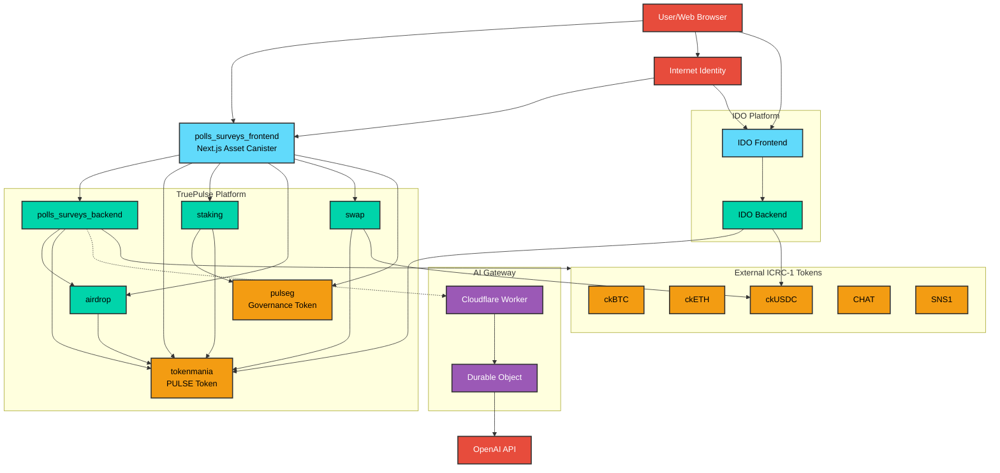

# TruePulse System Architecture - Simplified View

This is a simplified connectivity diagram showing how the different components and services in the TruePulse ecosystem connect to each other, without detailed interaction labels.

For the detailed version with interaction descriptions and data flows, see [ARCHITECTURE.md](./ARCHITECTURE.md).

## System Component Connectivity

## Component Legend

### Color Coding
- **Blue** - Frontend/UI components
- **Green** - Backend canisters (business logic)
- **Orange** - Token canisters (ICRC-1)
- **Red** - External services
- **Purple** - AI Gateway (Cloudflare Workers)
- **Light Blue** - IDO platform components

### Connection Types
- **Solid lines** (→) - Direct connections/API calls
- **Dotted lines** (-.→) - HTTP outcalls or external integrations

## Quick Reference

### TruePulse Platform (6 Canisters)
1. `polls_surveys_backend` - Core business logic
2. `tokenmania` - PULSE utility token
3. `pulseg` - Governance token
4. `staking` - Token staking
5. `airdrop` - Quest & campaign management
6. `swap` - Token exchange

### IDO Platform (2 Canisters)
1. `IDO Backend` - Vested token sales
2. `IDO Frontend` - IDO web interface

### AI Gateway (Cloudflare Workers)
1. `Worker` - Request router
2. `Durable Object` - AI cache & consensus

### External Services
- Internet Identity - ICP authentication
- OpenAI API - AI content generation
- ICRC-1 Tokens - ckBTC, ckETH, ckUSDC, CHAT, SNS1

---

**Note**: This diagram shows connectivity only. For detailed information about data flows, interaction types, and system behavior, please refer to [ARCHITECTURE.md](./ARCHITECTURE.md).
